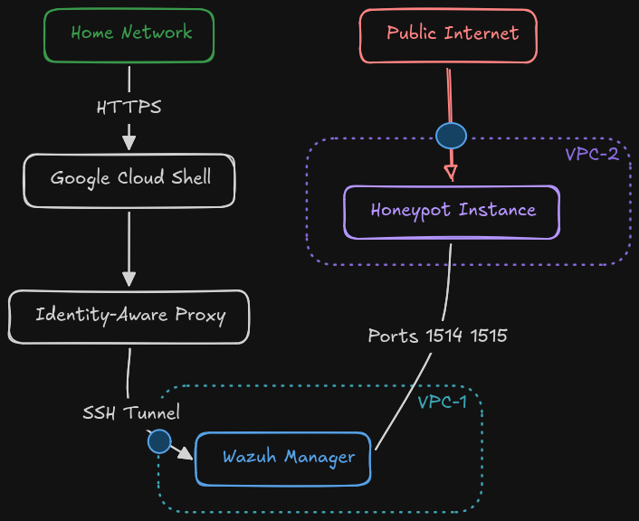
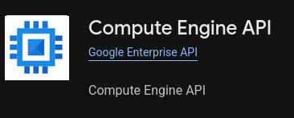
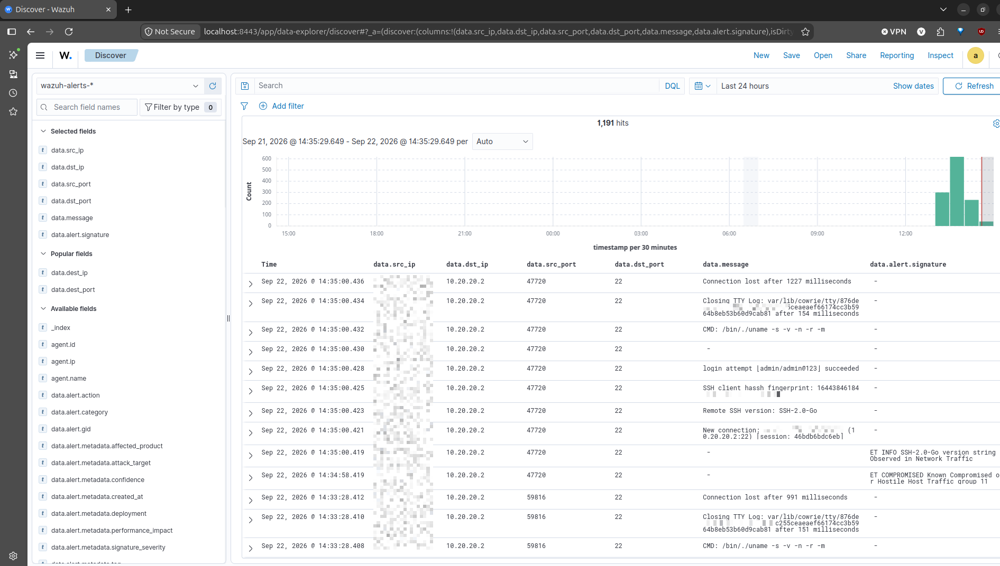
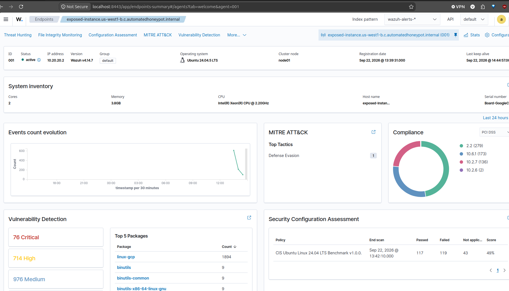

# Automated GCP Honeypot Deployment (Wazuh, Cowrie, Suricata)

This repository contains the Terraform infrastructure-as-code and startup scripts to deploy a highly secure, automated honeypot environment on Google Cloud Platform (GCP). 

## Architecture Overview

The goal of this deployment is to safely expose a vulnerable-looking machine to the internet to gather threat intelligence (brute force attempts, malware payloads, and attacker behavior) while keeping your core monitoring infrastructure completely hidden and secure.

To achieve this, the architecture is split into two distinct, peered Virtual Private Clouds (VPCs):

1. **VPC-1 (The Monitor Environment):** Completely private. It hosts a `monitor-instance` running the Wazuh Manager. It has no external IP address, is shielded behind Cloud NAT (temporarily, for setup), and only allows administrative access via GCP Identity-Aware Proxy (IAP). 
2. **VPC-2 (The Exposed Environment):** Hosts the `exposed-instance` running a Cowrie SSH/Telnet honeypot and a Suricata Intrusion Detection System (IDS). This machine has a public IP address to attract attackers. 

**Security:**
* **Asymmetric Communication:** VPC Peering allows the exposed honeypot to securely send logs to the private monitor, but firewall rules strictly block the honeypot from scanning or attacking the monitor environment.
* **Metadata Protection:** The exposed instance uses OS-level `iptables` to block access to the GCP Metadata server (`169.254.169.254`), preventing a compromised honeypot from stealing cloud credentials.
* **Phase 4 Lockdown:** The deployment utilizes a two-step Terraform process. Initial setup allows internet access to download packages. Once configured, a "Post-Config" Terraform run aggressively locks down the environment — deleting the NAT gateway and enforcing strict egress controls on the honeypot.


---

## Initial Setup

Before running the deployment, you must set up your Google Cloud environment and local workstation.

### 1. Set Up Google Cloud Platform (GCP)
1. Navigate to the [Google Cloud Console](https://console.cloud.google.com/).
2. Create a new Project and note the **Project ID** (you will need this later).
3. Open the **Billing** section and link an active billing account to your new project.
4. Enable the Compute Engine API:
   * Go to **APIs & Services** > **Library**.
   * Search for **Compute Engine API** and click **Enable**.



### 2. Install Google Cloud CLI (`gcloud`)
You need the `gcloud` CLI to authenticate Terraform and securely access your instances via IAP.
* Follow the official installation guide for your OS: [Install gcloud CLI](https://cloud.google.com/sdk/docs/install)
* Once installed, authenticate with your Google account:
  ```bash
  gcloud auth login
  gcloud auth application-default login
  gcloud config set project YOUR_PROJECT_ID
  gcloud auth application-default set-quota-project YOUR_PROJECT_ID
  ```

### 3. Install Terraform
If you do not have Terraform installed, use the following commands (for Ubuntu/Debian) to install it quickly:
```bash
sudo apt-get update && sudo apt-get install -y gnupg software-properties-common
wget -O- [https://apt.releases.hashicorp.com/gpg](https://apt.releases.hashicorp.com/gpg) | \
gpg --dearmor | \
sudo tee /usr/share/keyrings/hashicorp-archive-keyring.gpg > /dev/null
echo "deb [signed-by=/usr/share/keyrings/hashicorp-archive-keyring.gpg] \
[https://apt.releases.hashicorp.com](https://apt.releases.hashicorp.com) $(lsb_release -cs) main" | \
sudo tee /etc/apt/sources.list.d/hashicorp.list
sudo apt-get update && sudo apt-get install terraform
```

## Deployment Instructions

### Step 1: Generate the SSH Key
The `monitor-instance` has SSH access locked down tightly. It requires a specifically named SSH key. Run this command on your local machine to generate it (leave the passphrase blank when prompted for automated access):
```bash
ssh-keygen -t ed25519 -f ~/.ssh/monitor_instance_key -C "analyst"
```

### Step 2: Initialize Terraform
Navigate to the directory containing your `.tf` files and initialize the project to download the necessary GCP providers:
```bash
terraform init
```

### Step 3: Execute Phases 1-3 (Infrastructure & Installation)
Run the first deployment pass. This builds the VPCs, creates the NAT gateway for internet access, spins up the VMs, and triggers the automated installation scripts.

Replace `YOUR_PROJECT_ID` with your actual GCP Project ID:
```bash
terraform apply -var="project_id=YOUR_PROJECT_ID"
```
*Type `yes` when prompted to confirm the deployment.*

### Step 4: Monitor the Installation (Crucial)
The virtual machines are created quickly, but the Wazuh, Cowrie, and Suricata installations may take 10+ minutes to complete. You can watch the live installation logs using the GCP serial console to ensure everything succeeds.

Open two new terminal windows and run these commands:

**Terminal A (Watch the Monitor Instance):**
```bash
gcloud compute instances tail-serial-port-output monitor-instance --zone us-west1-b
```
IMPORTANT: During the monitor-instance setup, Wazuh will generate and print an admin password to this console. Record this password, as you will need it to log into the SIEM dashboard later (User: admin).

**Terminal B (Watch the Exposed Instance):**
```bash
gcloud compute instances tail-serial-port-output exposed-instance --zone us-west1-b
```

*Wait until both logs display:* `[*] Monitor/Exposed setup completed successfully!`

### Step 5: Execute Phase 4 (Post-Config Lockdown)
Once both instances have finished their startup scripts and the honeypot has successfully registered with the Wazuh manager, you must lock down the environment. 

Run Terraform again, but this time pass the `post_config_applied=true` variable:
```bash
terraform apply -var="project_id=YOUR_PROJECT_ID" -var="post_config_applied=true"
```
*Type `yes` when prompted.*

**What this does:**
* Deletes the Cloud Router and NAT Gateway, completely severing internet access for the `monitor-instance`.
* Applies a strict "Deny All" egress firewall rule to the honeypot.
* Drops the Wazuh enrollment port (1515) so no new agents can join.
* Blocks lateral movement from the honeypot to any private ranges.

---

## Accessing Your Environment

Because the `monitor-instance` has no external IP address, you cannot SSH into it directly over the internet. You must use Google's Identity-Aware Proxy (IAP) tunnel to access the command line and the Wazuh web interface. 

**To connect and configure the monitor via SSH:**
```bash
ssh -i ~/.ssh/monitor_instance_key analyst@monitor-instance -o ProxyCommand="gcloud compute start-iap-tunnel monitor-instance 22 --listen-on-stdin --zone=us-west1-b"
```

**To view the Wazuh SIEM Dashboard:**
Since the web interface is not exposed to the internet, you must securely tunnel the connection through SSH. Run the following command to forward your local port 8443 (you can use any) to the monitor's port 443:

```bash
ssh -i ~/.ssh/monitor_instance_key -N -L 8443:localhost:443 analyst@monitor-instance -o ProxyCommand="gcloud compute start-iap-tunnel monitor-instance 22 --listen-on-stdin --zone=us-west1-b"
```
Once the command is running, open your web browser and navigate to https://localhost:8443 to access the dashboard.

User: admin
Password: Use the password you recorded during Step 4. If you missed it, you can retrieve it by SSHing into the monitor-instance and running:
```bash
sudo tar -O -xvf /wazuh-install-files.tar wazuh-install-files/wazuh-passwords.txt
```

### To test your honeypot
Simulate an attacker scanning your public IP:
```bash
sudo nmap -p 22,23 -A -T4 <target_ip>
sudo nmap -p 22,23 -A -Pn <target_ip>
```

### Wazuh Dashboard Tips

    Refresh Index Fields: After you get your first alerts, Wazuh will dynamically generate new fields (like dst_ip). Go to Dashboard Management -> Index Patterns -> wazuh-alerts* and click the Refresh field list button (the circular arrow icon at the top right) to ensure the SIEM recognizes them.

    Viewing All Traffic: By default, Wazuh only shows triggered alerts. In case you want to see all traffic that goes into Cowrie (even noise that wasn't triggered by basic rules), navigate to Dashboard Management -> Index Patterns and click Create index pattern. Enter wazuh-archives* to explore raw traffic logs.

### Fixing Data Normalization (Suricata vs. Cowrie Fields)

Connect to your monitor-instance and open the Filebeat configuration:
```bash
sudo nano /etc/filebeat/filebeat.yml
```
Scroll to the very bottom of the file and paste this Javascript processor. (Make sure the indentation aligns perfectly with the left margin!)

```bash
processors:
  - script:
      lang: javascript
      id: normalize_suricata
      source: >
        function process(event) {
            var msg = event.Get("message");
            if (msg) {
                msg = msg.replace(/"dest_ip":/g, '"dst_ip":');
                msg = msg.replace(/"dest_port":/g, '"dst_port":');
                event.Put("message", msg);
            }
        }
```

Run a quick test and restart Filebeat:

```bash
sudo filebeat test config
sudo systemctl restart filebeat
```

### Troubleshooting & Maintenance

If you need to completely rebuild the honeypot (for example, to clear an infected state or test a new startup script), taint the resource and reapply:
```bash
terraform taint google_compute_instance.exposed_instance
terraform apply -var="project_id=YOUR_PROJECT_ID"
```

### References

Cowrie honeypot -> https://docs.cowrie.org/en/stable/INSTALL.html

Wazuh -> https://documentation.wazuh.com/current/quickstart.html

Suricata -> https://docs.suricata.io/en/suricata-8.0.7/install.html

Terraform on GCP -> https://docs.cloud.google.com/docs/terraform/terraform-overview

Terraform -> https://registry.terraform.io/providers/hashicorp/google/latest/docs


**If you find any misconfigurations or would like to suggest any improvements, don't hesitate to reach out or send a pull request!**




